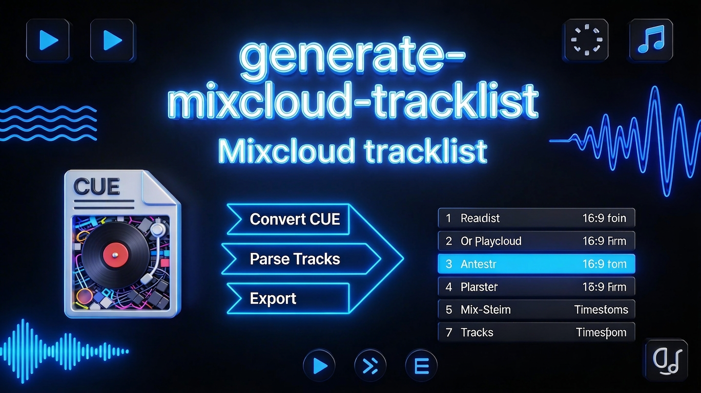

# Generate Mixcloud Tracklist from Rekordbox CUE file

[](https://github.com/holgerkampffmeyer2/generate-mixcloud-tracklist/blob/main/scorecard-report.md)


AI-agent driven tool for converting Rekordbox CUE files to Mixcloud-compatible tracklists. Designed to be controlled by AI coding assistants like [opencode](https://opencode.ai) or Claude Code.

Just paste the generated Tracklist into the tracklist box when you are uploading mixes to Mixcloud.


## Usage

```bash
opencode
```

Then ask Opencode to convert your CUE file:

```
Convert the file "path/to/your Rekordbox.cue" to a tracklist for Mixcloud
```

Opencode will:
1. Parse the CUE file
2. Extract artist, title, and timestamps from INDEX 01
3. Filter out tracks with "Jingle" in the title
4. Create an engaging Mixcloud title and description
5. Create a tracklist file with the same name as input, e.g., `MyMix.cue` → `MyMix-tracklist.txt`
6. No track numbering in output

## Output

Generates a `*tracklist.txt` file with format:

```
# Mix Title
## Engaging description (2-3 sentences, makes listeners curious)

If you enjoy, please fav, repost, comment!
✨Your DJ Name ✨

---

TRACKLIST:

Performer - Title HH:MM:SS
...
```

Tracks containing "Jingle" in the title are automatically excluded.

## License

MIT

---

**Holger Kampffmeyer** (DJ Hulk)

- Website: [holger-kampffmeyer.de](https://holger-kampffmeyer.de)
- Email: holger.kampffmeyer+dj@gmail.com
- Instagram: [@djhulk_de](https://instagram.com/djhulk_de)
- YouTube: [@djhulk_de](https://youtube.com/@djhulk_de)
- Mixcloud: [holger-kampffmeyer](https://mixcloud.com/holger-kampffmeyer)
- LinkedIn: [holger-kampffmeyer](https://linkedin.com/in/holger-kampffmeyer-390b6789)

**Note**: This tool is designed to be used with AI coding assistants.
